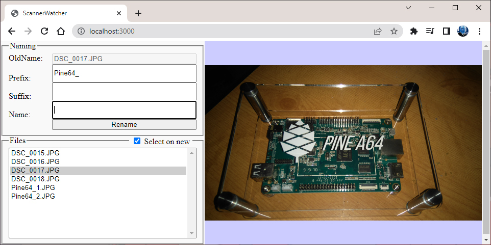

# ScannerWatcher

A simple application to watch new file arrive when scanning allowing you to check the result and rename files. 



## Setup
Install packages 
```sh
npm install
```

Update config
```json
    "server" : {
        "portNumber" : 3000 // Port number to run server on.      
    },
    "fileWatcher" : {
        "directory" : ""  // Directory To watch new files arrive 
    }
```

Run
```sh
node index.js
> ScannerWatcher - localhost:3000
```

## References
* [chokidar](https://github.com/paulmillr/chokidar) - Node file watching library
* [express](https://expressjs.com/) - Node web framework 
* [express-ws](https://github.com/HenningM/express-ws) - Express WebSocket extension
* [ejs](https://github.com/mde/ejs) - Node template engine